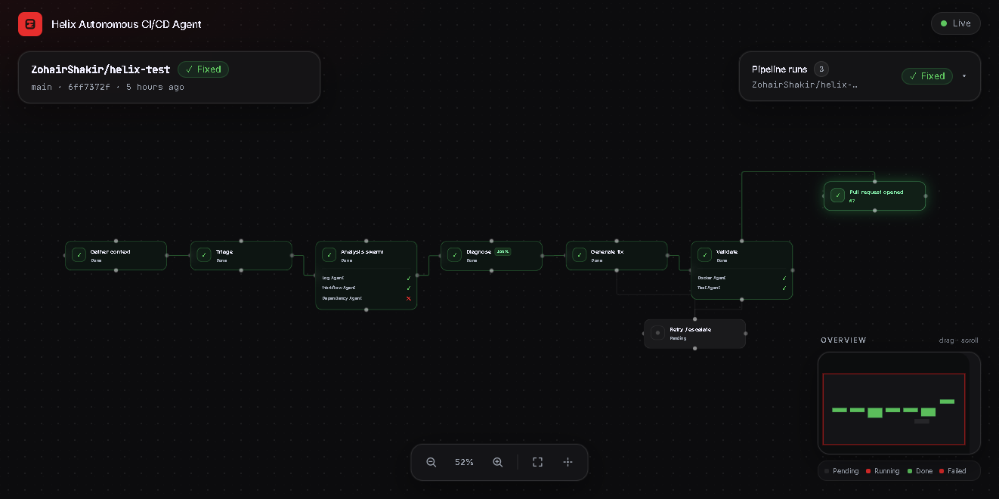
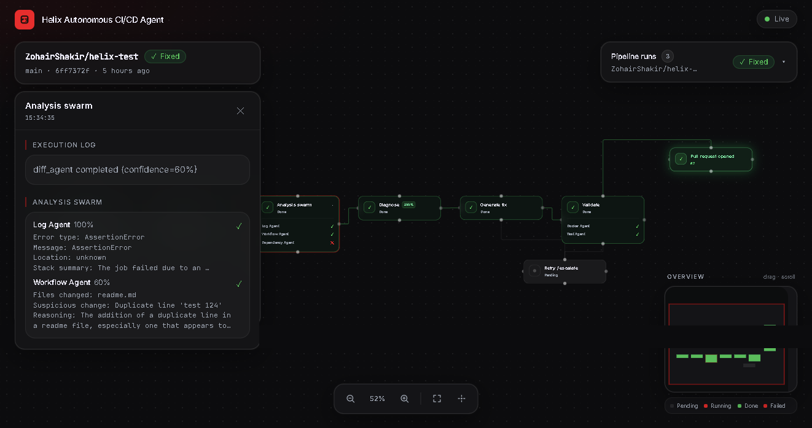
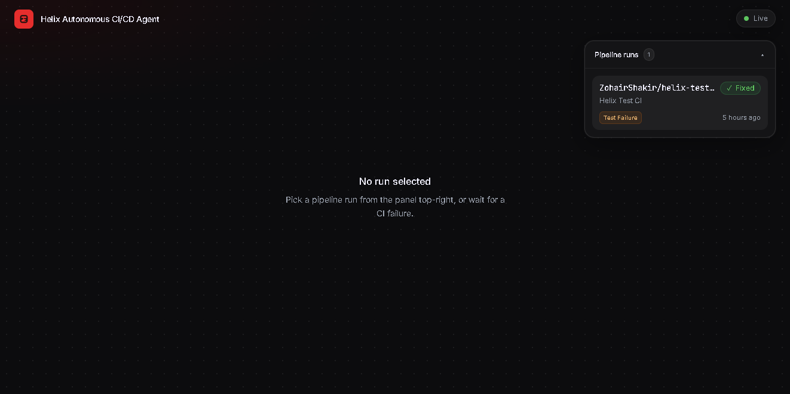
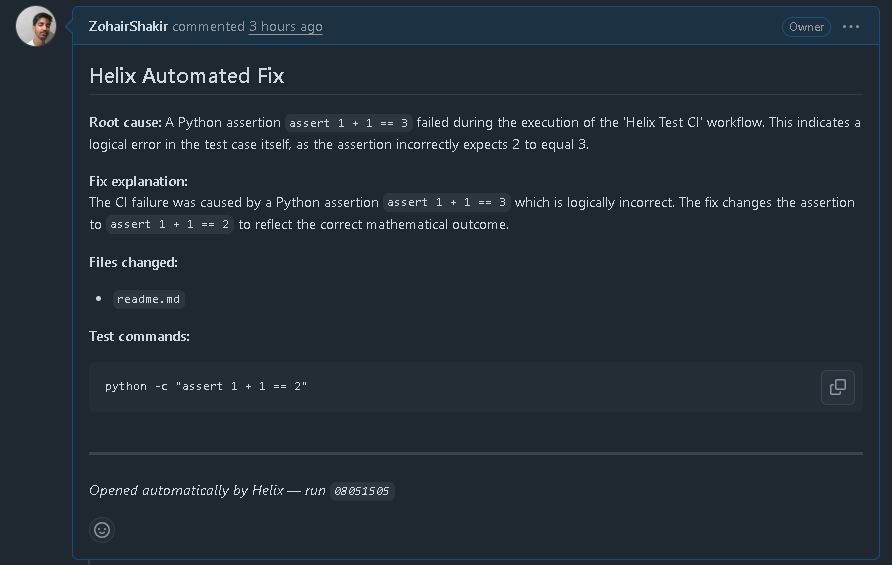

# 🧬 Helix — Autonomous Self-Healing CI/CD Agent

Helix is an autonomous AI agent that monitors your GitHub Actions pipelines and automatically diagnoses failures, generates fixes, validates them in Docker sandboxes, and opens pull requests — all in real time.

---

## 📸 Screenshots

| Dashboard Overview | Node Selection |
|:------------------:|:--------------:|
|  |  |

| Empty State | Github PR |
|:-----------:|:--------------:|
|  |  |

---


## ✨ What Helix Does

When a GitHub Actions pipeline fails, Helix automatically:

1. **Receives** the failure via GitHub webhook
2. **Fetches** logs, commit diff, and dependency manifests from GitHub
3. **Spins up specialist agents in parallel** — log analysis, code diff analysis, dependency check
4. **Synthesises** a root-cause diagnosis with a confidence score
5. **Generates** a unified-diff code fix using Google Gemini
6. **Validates** the fix inside an isolated Docker sandbox
7. **Opens a pull request** with the fix and a full explanation
8. **Retries** with a new strategy if validation fails (up to `MAX_RETRY_ATTEMPTS`)
9. **Escalates** via the dashboard if all retries fail
10. **Streams** every step in real time to the React dashboard via WebSockets

```
helix/
├── backend/                    # FastAPI + asyncio + Google Gemini
│   ├── main.py                 # Webhook + WebSocket + REST API
│   ├── orchestrator.py         # 8-step async pipeline
│   ├── agents/
│   │   ├── log_agent.py        # CI log analysis (Gemini 1.5 Flash)
│   │   ├── diff_agent.py       # Git diff analysis (Gemini 2.5 Flash Lite)
│   │   └── dep_agent.py        # Dependency conflict detection (Gemini 1.5 Flash)
│   ├── tools/
│   │   ├── github_tools.py     # GitHub API (logs, diff, deps, PRs)
│   │   └── sandbox.py          # Docker sandbox execution
│   ├── models.py               # Pydantic domain models
│   ├── config.py               # Environment variable management
│   └── store.py                # In-memory state + WebSocket broadcaster
│
└── frontend/                   # React + Vite + Tailwind
    └── src/
        ├── App.jsx             # Two-panel layout + top bar
        ├── hooks/
        │   └── useHelixSocket.js  # WebSocket connection + state
        └── components/
            ├── RunFeed.jsx        # Scrollable run list
            ├── RunCard.jsx        # Single run summary card
            ├── RunDetail.jsx      # Full run detail panel
            ├── AgentTrace.jsx     # Step-by-step timeline
            ├── DiagnosisCard.jsx  # Root cause + confidence ring
            ├── DiffViewer.jsx     # Monaco diff editor
            ├── SandboxResult.jsx  # Docker validation output
            ├── PRCard.jsx         # PR link card
            └── StatusBadge.jsx    # Animated status pill
```

---

## 🚀 Getting Started

### Prerequisites

- Python 3.10+
- Node.js 18+
- Docker Desktop (optional — sandbox validation is skipped gracefully if Docker is unavailable)
- A [Google Gemini API key](https://aistudio.google.com/apikey)
- A GitHub Personal Access Token with `repo` + `workflow` scopes

---

### 1. Clone & Configure

```bash
git clone https://github.com/your-org/helix.git
cd helix
```

Copy the environment template and fill in your credentials:

```bash
cd backend
cp .env.example .env
```

Edit `backend/.env`:

```env
GEMINI_API_KEY=your_gemini_api_key_here
GITHUB_TOKEN=ghp_...
GITHUB_WEBHOOK_SECRET=your_random_secret_here
MAX_RETRY_ATTEMPTS=3
SANDBOX_TIMEOUT_SECONDS=60
FRONTEND_URL=http://localhost:5173
```

---

### 2. Start the Backend

```bash
cd backend
python -m venv venv
# Windows:
venv\Scripts\activate
# macOS/Linux:
source venv/bin/activate

pip install -r requirements.txt
python main.py
```

The FastAPI server starts at **http://localhost:8000**.

---

### 3. Start the Frontend

```bash
cd frontend
npm install
npm run dev
```

The Vite dev server starts at **http://localhost:5173**.

---

### 4. Configure GitHub Webhook

In your GitHub repository settings → **Webhooks → Add webhook**:

| Field | Value |
|-------|-------|
| Payload URL | `https://your-domain.com/webhook/github` (use [ngrok](https://ngrok.com) for local dev) |
| Content type | `application/json` |
| Secret | Same value as `GITHUB_WEBHOOK_SECRET` in your `.env` |
| Events | **Workflow runs** |

For local development with ngrok:

```bash
ngrok http 8000
# Copy the https URL and paste it as your webhook Payload URL
```

---

## 🔌 API Reference

### REST Endpoints

| Method | Path | Description |
|--------|------|-------------|
| `GET` | `/health` | Health check — returns `{status, active_runs}` |
| `GET` | `/runs` | All Helix runs (newest first) |
| `GET` | `/runs/{run_id}` | Single run by ID |
| `POST` | `/webhook/github` | GitHub Actions webhook receiver |

### WebSocket

Connect to `ws://localhost:8000/ws` to receive real-time events:

| Event | Payload |
|-------|---------|
| `full_state` | Array of all current runs (sent on connect) |
| `run_created` | New HelixRun object |
| `trace_update` | `{ run_id, trace[] }` |
| `diagnosis_ready` | `{ run_id, diagnosis }` |
| `fix_ready` | `{ run_id, fix }` |
| `sandbox_result` | `{ run_id, sandbox_output }` |
| `run_complete` | Full HelixRun (PR opened or escalated) |

---

## 🤖 Pipeline

The orchestrator runs an 8-step async pipeline (no external graph library — uses `asyncio.gather` for parallelism):

```
assemble_context
      │
    triage
      │
  run_specialists  (log + diff + dep agents — parallel)
      │
   diagnose
      │
  generate_fix  ◄──────────────┐
      │                        │
   validate                    │
      │                        │
  ┌───┴───┐                    │
  │       │                    │
open_pr  retry_or_escalate ────┘
  │            │
 END          END (if max retries reached)
```

### Run statuses

| Status | Meaning |
|--------|---------|
| `watching` | Run created, pipeline starting |
| `diagnosing` | Gathering context and analysing failure |
| `fixing` | Generating a patch |
| `validating` | Running fix in Docker sandbox |
| `fixed` | PR opened successfully |
| `escalated` | All retries exhausted or unrecoverable error |

---

## 🎨 Design System

| Token | Value |
|-------|-------|
| Background | `#0A0A0F` |
| Surface | `#111118` |
| Border | `#1E1E2E` |
| Primary | `#6E56CF` (purple) |
| Success | `#22C55E` |
| Error | `#EF4444` |
| Warning | `#F59E0B` |
| Text Primary | `#F1F0FF` |
| Text Muted | `#6B7280` |
| Font | Inter (body) + JetBrains Mono (code) |

---

## 🔒 Security Notes

- All webhook requests are verified with HMAC-SHA256 using `GITHUB_WEBHOOK_SECRET`
- Docker sandbox runs with network disabled and memory limited to 256 MB
- No credentials are ever hardcoded — all config via `.env`
- The GitHub token only needs `repo` + `workflow` scopes (use a fine-grained PAT)

---

## 📝 Tech Stack

| Layer | Technology |
|-------|-----------|
| AI Backbone | Google Gemini (`gemini-2.5-flash-lite` for orchestration/fix generation, `gemini-1.5-flash` for specialist agents) |
| Agent Orchestration | Python asyncio (sequential pipeline with parallel agent steps) |
| Backend Framework | FastAPI + uvicorn |
| Real-time | WebSockets (native) |
| State | In-memory store (runs reset on server restart) |
| GitHub Integration | PyGitHub |
| Sandbox | Docker SDK for Python (`python:3.11-slim`, network off, 256 MB RAM) |
| Frontend | React 18 + Vite |
| Styling | Tailwind CSS |
| Animations | Framer Motion |
| Diff Viewer | Monaco Editor |
| Charts | Recharts (confidence ring) |

---

> 🧬 *Helix — because your CI/CD pipeline deserves a second opinion.*
